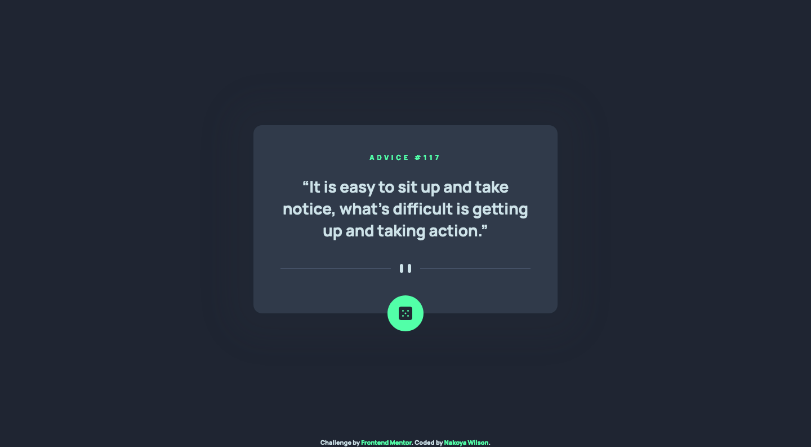

# Frontend Mentor - Advice generator app solution

This is a solution to the [Advice generator app challenge on Frontend Mentor](https://www.frontendmentor.io/challenges/advice-generator-app-QdUG-13db). Frontend Mentor challenges help you improve your coding skills by building realistic projects.

## Table of contents

- [Overview](#overview)
  - [The challenge](#the-challenge)
  - [Screenshot](#screenshot)
  - [Links](#links)
- [My process](#my-process)
  - [Built with](#built-with)
- [Author](#author)

## Overview

### The challenge

Users should be able to:

-

### Screenshot

### Links

- Solution URL: [https://www.frontendmentor.io/solutions/mobile-first-advice-generator-app-jPeYsQA22](https://www.frontendmentor.io/solutions/mobile-first-advice-generator-app-jPeYsQA22)
- Live Site URL: [https://github.com/nakoyawilson/advice-generator-app](https://github.com/nakoyawilson/advice-generator-app)

## My process

### Built with

- HTML
- CSS
- JavaScript
- Mobile-first workflow
- [Axios](https://axios-http.com/)

## Author

- Website - [Nakoya Wilson](https://nakoyawilson.netlify.app/)
- Frontend Mentor - [@nakoyawilson](https://www.frontendmentor.io/profile/nakoyawilson)
- Twitter - [@nakoyawilson](https://twitter.com/nakoyawilson)
- LinkedIn - [@nakoyawilson](https://www.linkedin.com/in/nakoyawilson/)
